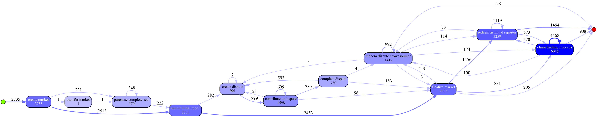

# Augur {#augur}

- **DApp Homepage:** <https://augur.net>
- **DApp Source Code:** <https://github.com/AugurProject/augur-core>
- **ELF Script:** [Augur.ethql](./elf-scripts/Augur.ethql)
- **Event Log:** [Augur.xes](./data/Augur.xes)
- **Process:** [Augur.bpmn](./data/Augur.bpmn)
- **Object-centric Event Log:** [Augur.csv](https://tubcloud.tu-berlin.de/s/zyytGgrxx6j6ocY)

Augur is a betting platform and prediction marketplace that is implemented as a set of smart contracts on the public Ethereum blockchain. Augur’s white paper characterizes the mechanics of a prediction and betting market: “individuals can speculate on the outcomes of future events; those who forecast the outcome correctly win money, and those who forecast incorrectly lose money.” As a betting market organized on Ethereum, the developers claim that Augur bypasses disadvantages of traditional betting markets, such as trusted market operator and limited participation.

## Data Overview

Each trace in the Augur log captures the events that occur in relation to a specific betting market.
Each trace has the following attributes:

- ``marketType`` (xs:string) - The type of the market: *yes/no-markets* deal with binary questions, while *categorical* and *scalar* markets expect discrete and numeric answers
- ``description`` (xs:string) - A description of the bet or question that is asked
- ``extraInfo`` (xs:string) - Additional information about the bet or question
- ``minPrice`` (xs:int) - The minimum price for the answer
- ``maxPrice`` (xs:int) - The maximum price for the answer

In addition, each event has a set of standard attributes:

- ``concept:name`` (xs:string) - The class of the event
- ``time:timestamp`` (xs:date) - The timestamp of the block that included the event
- ``lifecycle:transition`` (xs:string) - The lifecycle transition of each event, for all events set to ``Completed`` by default. This attribute exists to ensure compatibility with [XES-certified tools](https://www.tf-pm.org/resources/xes-standard/for-vendors/certification)
- ``blockNumber`` (xs:int) - The number of the block that included the event
- ``requester`` (xs:string) - The address of the transaction sender
- ``receivingContract`` (xs:string) - The address of the transaction recipient (typically of an Augur contract)
- ``txIndex`` (xs:int) - The index of the transaction that included the event
- ``txHash`` (xs:string) - The hash of the transaction that included the event
- ``txSuccessful`` (xs:boolean) - A flag indicated whether the transaction was successfully executed
- ``logRemoved`` (xs:boolean) - A flag indicated whether the log was removed
- ``gas`` (xs:int) - The amount of gas set as the gas limit by the transaction requester
- ``gasUsed`` (xs:int) - The amount of gas that was consumed by the transaction
- ``gasPaid`` (xs:int) - The amount of Ether that was paid for the execution of the transaction
- ``gasPrice`` (xs:int) - The gas price set by the transaction sender
- ``universe`` (xs:string) - The address of the Augur instance in which the event occurred

The following events can occur during a market's lifetime: 

- *create market* - The betting market is initialized
  - ``creator`` (xs:string) - The address of the market creator
  - ``creationFee`` (xs:int) - The price paid for the creation of the market
- *submit initial report* - An initial answer for the betting market is submitted
  - ``reporter`` (xs:string) - The address of the reporter providing the answer
  - ``amountStaked`` (xs:int) - The amount of reputation token owned by the reporter
  - ``isDesignatedReporter`` (xs:boolean) - A flag indicating whether the reporter was the initally assigned reporter
  - ``invalid`` (xs:boolean) - A flag indicating whether the answer was flagged as INVALID by the reporter
- *purchase complete sets* - A user invests in an anticipated answer
  - ``account`` (xs:string) - The address of the user who buys shares
  - ``numCompleteSets`` (xs:int) - The number of shares that are bought
- *create dispute* - A discussion about a provided answer is started
  - ``disputeCrowdsourcer`` (xs:string) - The address of the user who creates the dispute
  - ``size`` (xs:int) - The amount of reputation token owned by the reporter
  - ``invalid`` (xs:boolean) - A flag indicating whether the answer was flagged as INVALID by the reporter
- *contribute to dispute* - A user adds to a discussion about a provided answer
  - ``reporter`` (xs:string) - The address of the user who contributes to the answer
  - ``disputeCrowdsourcer`` (xs:string) - The address of the user who is targeted in the dispute
  - ``amountStaked`` (xs:int) - The amount of staked reputation 
- *redeem dispute crowdsourcer* - A user tries to obtain his or her revenue from the dispute
  - ``reporter`` (xs:string) - The address of the user
  - ``disputeCrowdsourcer`` (xs:string) - The address of the user initiating the transaction
  - ``amountRedeemed`` (xs:int) - The amount of redeemed Ether
  - ``repReceived`` (xs:int) - The amount of received reputation
  - ``reportingFeesReceived`` (xs:int) - The amount of received reporting fees 
- *complete dispute* - A discussion about a provided answer is closed
  - ``disputeCrowdsourcer`` as xs:string disputeCrowdsourcer,
- *finalize market* - The betting market is closed
- *claim trading proceeds* - A user tries to obtain his or her revenue from the investment into an answer
  - ``shareToken`` (xs:string) - The address of the share token 
  - ``sender`` (xs:string) - The address of the user
  - ``numShares`` (xs:int) - The number of claimed shares
  - ``numPayoutTokens`` (xs:int) - The number of shares that the user owns
  - ``finalTokenBalance`` (xs:int) - The share balance of the user after the update
- *redeem as initial reporter* - A user tries to obtain his or her revenue for providing the initial answer
  - ``reporter`` (xs:string) - The address of the reporter
  - ``amountRedeemed`` (xs:int) - The amount of redeemed Ether
  - ``repReceived`` (xs:int) - The amount of redeemed Reputation
  - ``reportingFeesReceived`` (xs:int) - The amount of redeemed reporting fees
- *transfer market* - The betting market is transferred from one to another user
  - ``from`` (xs:string) - The address of the previous market owner
  - ``to`` (xs:string) - The address of the new market owner

## Preliminary Analysis

We conducted a case study on process mining for data extracted from Augur in [1, 2]. To  this  end,  we  used  process mining methods and tools to explore the data, discover models for a set of variants, and conduct conformance checking and performance analyses. 

The dotted chart shows different time intervals of increased activity and activity batches that were triggered within a short time frame.

Using conformance checking, we found that the implementation diverged from the documented architecture of the DApp and identified interesting deviations from the normative process. 

An interview with the chief architect of Augur validated our insights and more generally confirmed the usefulness of such insights for DApp development. 

**References**

[1] R. Hobeck, C. Klinkmüller, H.M.N.D. Bandara, I. Weber and W. van der Aalst (2021): “Process Mining on Blockchain Data: A Case Study of Augur”. In: International Conference on Business Process Management.

[2] R. Hobeck, C. Klinkmüller, D. HMN Bandara, I. Weber and W. van der Aalst (2024): "On the Suitability of Process Mining for
Enhancing Transparency of Blockchain Applications". Bus Inf Syst Eng.
