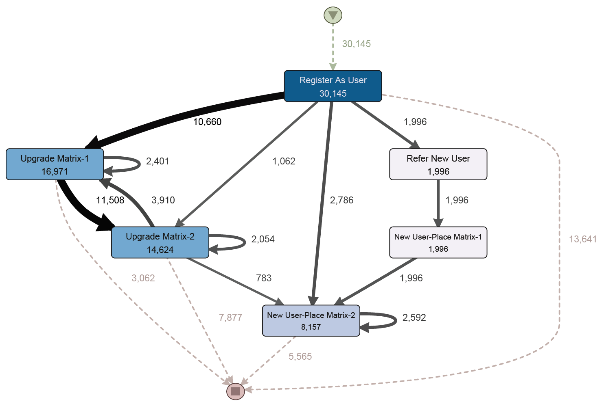

# Forsage {#forsage}

- **DApp Homepage:** <https://forsage.io>
- **DApp Source Code:** available on [etherscan.io](https://etherscan.io/address/0x5acc84a3e955Bdd76467d3348077d003f00fFB97#code)
- **ELF Script:** [Forsage.ethql](./elf-scripts/Forsage.ethql)
- **Event Log:** [Final_Forsage.xes.gz](./data/Final_Forsage.xes.gz)

On their [website](https://forsage.io), the developers of Forsage describe the DApp as a "Decentralized networking platform based on smart contracts that connects people from all over the world and opens up the limitless possibilities of the new economic financial system". However, detailed analyses of the DApp's mechanics, e.g., in [1], have shown that the DApp is in fact a Ponzi scheme, i.e., a fraud in which a few early investors generate profits based on the investments of later investors (see [Wikipedia](https://en.wikipedia.org/wiki/Ponzi_scheme)). On [etherscan.io](https://etherscan.io/address/0x5acc84a3e955Bdd76467d3348077d003f00fFB97) the DApp is currently marked as high risk with a note that this DApp is a Ponzi scheme.

## Data Overview

Each trace in the forsage log captures the events from the lifecycle of a Forsage user. Each trace has the following attributes:

- ``concept:name`` (xs:string) - the address of the Forsage user

In addition, each event has a set of standard attributes:

- ``concept:name`` (xs:string) - The class of the event
- ``time:timestamp`` (xs:date) - The timestamp of the block that included the event
- ``lifecycle:transition`` (xs:string) - The lifecycle transition of each event, for all events set to ``Completed`` by default. This attribute exists to ensure compatibility with [XES-certified tools](https://www.tf-pm.org/resources/xes-standard/for-vendors/certification)
- ``blockNumber`` (xs:int) - The number of the block that included the event
- ``transactionIndex`` (xs:int) - The index of the transaction that included the event
- ``logIndex`` (xs:int) - The index of the log that included the event

The following events can occur during the life of a Forsage user: 

- *Register As User* - The user is registering an account 
  - ``referrer`` (xs:string) - The address of the referring Forsage user
  - ``userId`` (xs:int) - The internal ID of the new Forsage user
- *Refer New User* - The user is referring a new user who created an account
  - ``user`` (xs:string) - The address of the new Forsage user
  - ``userId`` (xs:int) - The internal ID of the new Forsage user
- *Reinvest Matrix-1* - The user triggers a reinvest in the first matrix
  - ``level`` (xs:int) - The level of the user
  - ``currentReferrer`` (xs:string) - The address of the referrer receiving reinvest. This is the user’s referrer, if it has activated the level receiving the reinvest, otherwise a randomly selected referrer.
  - ``caller`` (xs:string) - The address of user triggering the reinvest
- *Reinvest Matrix-2* - The user triggers a reinvest in the second matrix
  - ``level`` (xs:int) - The level of the user
  - ``currentReferrer`` (xs:string) - The address of the referrer receiving reinvest. This is the user’s referrer, if this referrer has activated the level receiving the reinvest, otherwise a randomly selected referrer.
  - ``caller`` (xs:string) - The address of user triggering the reinvest
- *Upgrade Matrix-1* - The user upgrades the first matrix
  - ``level`` (xs:int) - The level of the matrix
  - ``referrer`` (xs:string) - The address of the referrer
- *Upgrade Matrix-2* - The user upgrades the first matrix
  - ``level`` (xs:int) - The level of the matrix
  - ``referrer`` (xs:string) - The address of the referrer
- *New User-Place Matrix-1* - The user buys a matrix slot in the first matrix
  - ``referrer`` (xs:string) - The address of the referrer
  - ``level`` (xs:int) - The level of the matrix
  - ``place`` (xs:int) - The slot in the matrix
- *New User-Place Matrix-2* - The user buys a matrix slot in the second matrix
  - ``referrer`` (xs:string) - The address of the referrer
  - ``level`` (xs:int) - The level of the matrix
  - ``place`` (xs:int) - The slot in the matrix
- *Missed Eth-Receive Matrix-1* - The user did not receive Ether for the first matrix
  - ``from`` (xs:string) - The address of the sender
  - ``level`` (xs:int) - The level of the matrix
- *Missed Eth-Receive Matrix-2* - The user did not receive Ether for the second matrix
  - ``from`` (xs:string) - The address of the sender
  - ``level`` (xs:int) - The level of the matrix
- *Received Extra Eth-Dividends Matrix-1* - The user received Ether for the first matrix
  - ``from`` (xs:string) - The address of the sender
  - ``level`` (xs:int) - The level of the matrix
- *Received Extra Eth-Dividends Matrix-2* - The user received Ether for the first matrix
  - ``from`` (xs:string) - The address of the sender
  - ``level`` (xs:int) - The level of the matrix

## Preliminary Analysis

Forsage is a pyramide and Ponzi scheme implemented in a set of Ethereum smart contracts. The basic building blocks of the Ponzi scheme referral system are so called *matrizes*. Matrix slots that users (referrers) create can be taken by other users (referees) by paying a fee. Fees are transferred upstream through the reference system. The key events for selling or buying a matrix slot are *New User-Place Matrix-1* and *New User-Place Matrix-2*.

The log has a size of ~6GB and contains 1,055,931 cases with 13,368,052 events. For the preliminary analysis, we hence only considered transactions between block 11280000 and 12243999 (934903 events, 72416 cases). Each case represents the trace of one registered user. The event log as-is specifies the referee’s ID for the \textit{New User-Place Matrix-1/2} events; to see beneficiaries of those events, we reassigned the referrer’s IDs to matrix-slot events and thus slightly altered the case IDs. We also filtered for cases that start with registering in Forsage as a user.

As a result, the above Figure shows two major findings for 37\% of the cases. Firstly, 45\% of the users only register (pay fees) without making any income. Secondly, in the short run users who upgrade their matrices (pay fees to referrers) right after registration have a lower number of references (payouts) than users who do not upgrade right after registration.

For the same log extract, we also analyzed how often users are referred to and how often users are referees. Note that the income from being referred to is at most 0.025 ETH, while the cost of creating an event is usually 0.05 ETH. That means the ratio of being referee to being referrer should at least be 2 to break even. Of the 42738 unique user IDs only 5448 (12.7\%) reached that goal, the rest of the observed users lost Ether. This observation is in line with the observations from Kell et al. [1]. In their analysis, Kell et al. deployed the Forsage smart contract in a test environment and excercised it with simulated load. By examining the generated event logs, Kell et al found that 88% of the Forsage users loose their investment, while only a small number of top-level participants is realizing gains.

**References**

[1] T. Kell, H. Yousaf, S. Allen, S. Meiklejohn and A. Juels (2021): "Forsage: Anatomy of a Smart-Contract Pyramid Scheme". <https://arxiv.org/abs/2105.04380>
