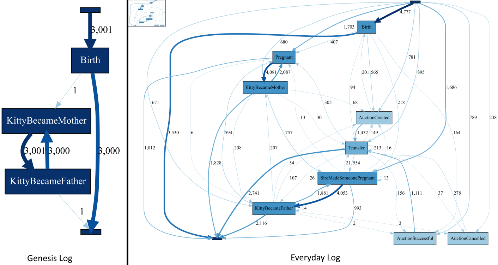

# CryptoKitties {#cryptokitties}

- **DApp Homepage:** <https://www.cryptokitties.co>
- **DApp Source Code:** available on [etherscan.io](https://etherscan.io/address/0x06012c8cf97bead5deae237070f9587f8e7a266d#code)
- **ELF Script:** [CryptoKitties.ethql](./elf-scripts/CryptoKitties.ethql)
- **Event Log:** [Final_CryptoKitties.xes.gz](./data/Final_CryptoKitties.xes.gz)

According to the [DApp's website](https://www.cryptokitties.co), CryptoKitties is "a game centered around breedable, collectible, and oh-soadorable creatures we call CryptoKitties". While not Ethereum's most serious application, it is a well-known example of a DApp (that is primarily based on smart contracts), has been used heavily at times (likely due to some of the kitties being sold for thousands of dollars), and has been in operation since December 2017. A CryptoKitty is the Ethereum version of a Tamagotchi. It is a digital asset owned by an Ethereum account, it can be traded, and it can breed new CryptoKitties. To breed a new CryptoKitty, the owner of a CryptoKitty can start a *siring* process. That is, the owner's CryptoKitty acts as the *matron* that gives birth to the new CryptoKitty which will then be owned by the matron's owner. However, the owner must have access to a second cat, the *sire*, either by owning it or by obtaining the permission of the sire's owner in a siring auction. A CryptoKitty is represented by an identifier and its DNA, from which its features and appearance are derived.

## Data Overview

Each trace in the CryptoKitties log captures the events from the life of a single CryptoKitty. Each trace has the following attributes:

- ``concept:name`` (xs:string) - The identifier of the CryptoKitty
- ``matronId`` (xs:string) - The identifier of the CryptoKitty's matron
- ``sireId`` (xs:string) - The identifier of the CryptoKitty's sire
- ``genes`` (xs:int) - The CryptoKitty's DNA

In addition, each event has a set of standard attributes:

- ``concept:name`` (xs:string) - The class of the event
- ``time:timestamp`` (xs:date) - The timestamp of the block that included the event
- ``lifecycle:transition`` (xs:string) - The lifecycle transition of each event, for all events set to ``Completed`` by default. This attribute exists to ensure compatibility with [XES-certified tools](https://www.tf-pm.org/resources/xes-standard/for-vendors/certification)
- ``blockNumber`` (xs:int) - The number of the block that included the event
- ``transactionIndex`` (xs:int) - The index of the transaction that included the event
- ``logIndex`` (xs:int) - The index of the log that included the event

The following events can occur during the life of a CrypotKitty: 

- *Is Born* - The birth of a CryptoKitty
  - ``owner`` (xs:string) - The owner of the CryptoKitty
- *Conceive as Matron* - The CryptoKitty becomes pregnant
  - ``sireId`` (xs:string) - The id of the CryptoKitty that is the sire
- *Conceive as Sire* - The CryptoKitty contributes to the pregnancy of a matron
  - ``matronId`` (xs:string) - The id of the CryptoKitty that is the matron
- *Give Birth as Matron* - The CryptoKitty becomes the matron of another CryptoKitty
  - ``kittyId`` (xs:string) - The id of the CryptoKitty that was born
  - ``sireId`` (xs:string) - The id of the CryptoKitty that is the sire
- *Give Birth as Sire* - The CryptoKitty becomes the sire of another CryptoKitty
  - ``kittyId`` (xs:string) - The id of the CryptoKitty that was born
  - ``matronId`` (xs:string) - The id of the CryptoKitty that is the matron
- *Put Up for Sale Auction* - The owner wants to sell the CryptoKitty
  - ``startingPrice`` (xs:int) - The price (in wei) at the beginning of the auction
  - ``endingPrice`` (xs:int) - The price (in wei)  at which the auction will end
  - ``duration`` (xs:int) - The duration for which the auction is running
- *Complete Sale Auction* - The sale auction is successfully completed
  - ``totalPrice`` (xs:int) - The price paid for the CryptoKitty
  - ``winner`` (xs:string) - The new owner of the CryptoKitty
- *Cancel Sale Auction* - The sale auction is aborted
- *Put Up for Siring Auction* - The owner offers his or her CryptoKitty for siring
  - ``startingPrice`` (xs:int) - The price (in wei) at the beginning of the auction
  - ``endingPrice`` (xs:int) - The price (in wei)  at which the auction will end
  - ``duration`` (xs:int) - The duration for which the auction is running
- *Complete Siring Auction* - The siring auction is successfully completed
  - ``totalPrice`` (xs:int) - The price paid for the CryptoKitty
  - ``winner`` (xs:string) - The owner of the matron who is looking for a sire 
- *Cancel Siring Auction* - The siring auction is aborted
- *Is Transferred* - The ownership of a CryptoKitty changes
  - ``from`` (xs:string) - The previous owner of the CryptoKitty
  - ``to`` (xs:string) - The new owner of the CryptoKitty

## Preliminary Analysis

We presented a preliminary analysis of CryptoKitties in [1] where we extracted event logs for two short time windows in the CryptoKitties lifecycle, the genesis log covering the period after DApp creation and the everyday log stemming from a later period after the DApp became popular. In the analysis, we used process discovery to contrast the DApps behavior in these two periods.

As the above figure shows, in the genesis period the DApp was solely used by the CryptoKitty developer who generated a set of CryptoKitties.
Later on, when the DApp was used by normal users, we observed that users bred and traded CryptoKitties. Such an analysis can provide valuable insights into the user behavior, which can inform DApp developers about improvement opportunities. In contrast to two logs that we used in the initial analysis, the event log provided on this page contains data about all CryptoKitty events that occurred in between blocks 4605167 (the creation block) and 12243999 (the block at which data extraction finished).

**References**

[1] C. Klinkmüller, A. Ponomarev, A.B. Tran, I. Weber, W. van der Aalst: Mining blockchain processes (2019): Extracting process mining data from blockchain applications. In: International Conference on Business Process Management (Blockchain Forum).
